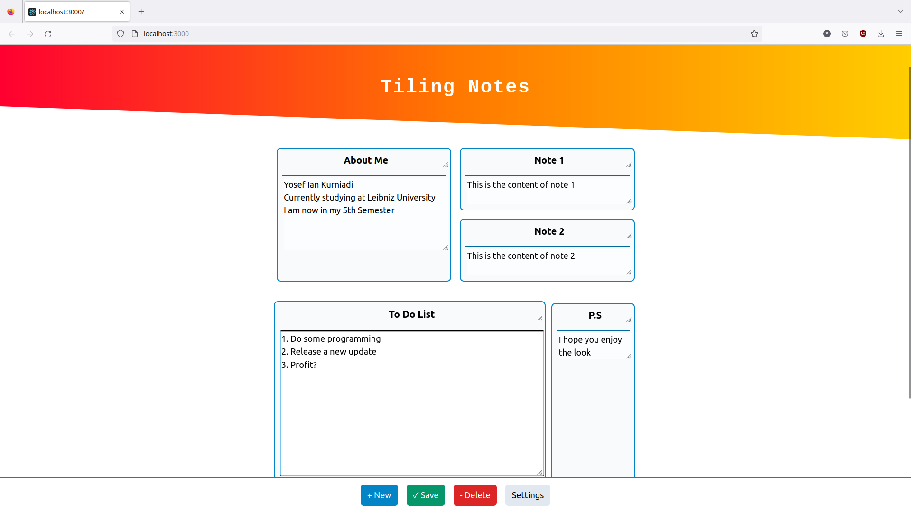
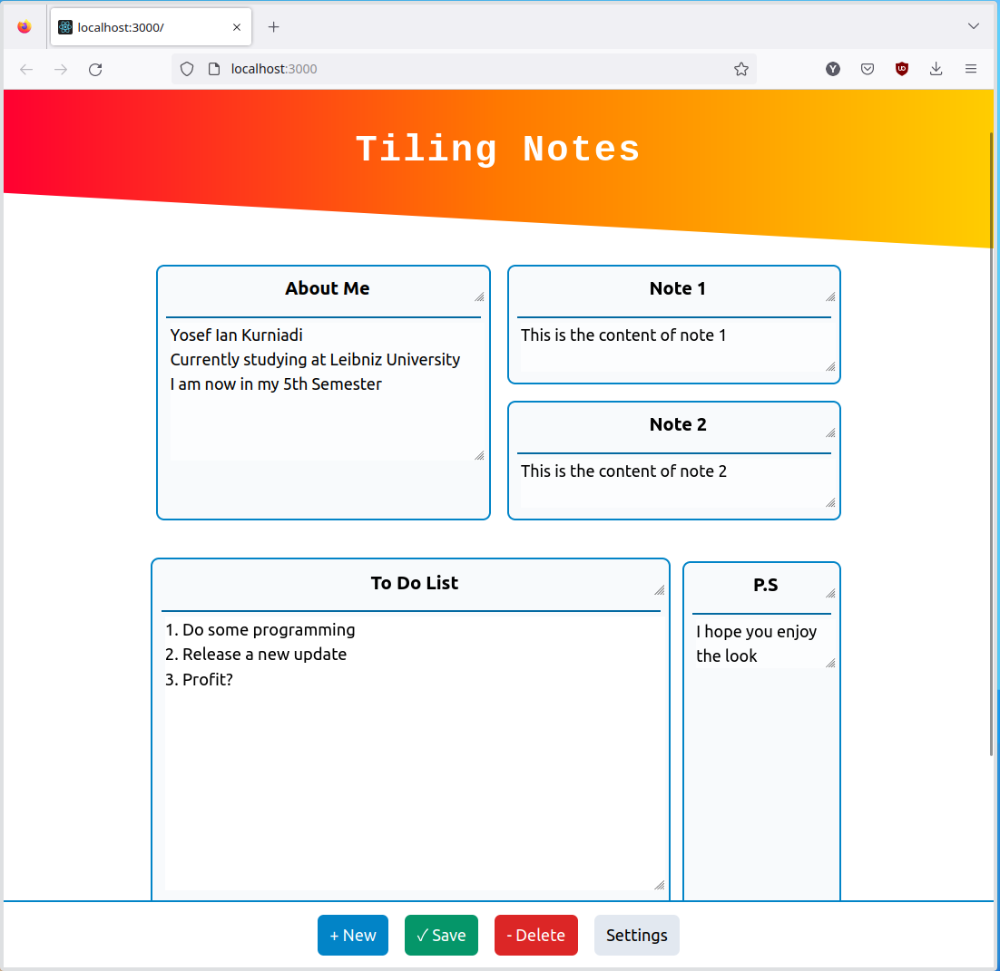

## **Tiling Notes**

If You are familiar with windows tiling manager, than this would be similar to that but this one is for notes rather than for desktop applications.
I made this with the help of React, Next.js and also TailwindCSS. 

### **Features**
- Quite flexible layout
- It's accesible on the web, or offline if you serve it with npm run dev
- Nice design
- Create as many notes as you want
- Autosave and Manual save support
- Several file support

More features coming soon!

### **Run**

#### **Method 1**
1. `git clone https://github.com/Remisys/TiledNotes.git`
2. Go to the main directory
3. `npm run dev`
4. open http://localhost:3000 in any browser
5. enjoy :)

#### **Method 2**
1. `git clone https://github.com/Remisys/TiledNotes.git`
2. Go to the main directory
3. `docker build -t notes .`
4. `docker run -p 3000:3000 notes` 

### **Screenshots**

Me trying to take notes

---

Me trying to demonstrate how to create a new sublayout below the tiled notes
