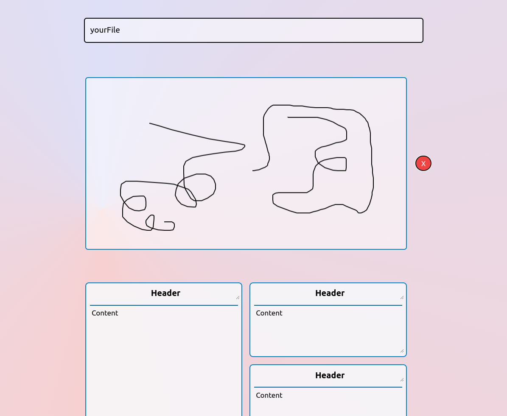
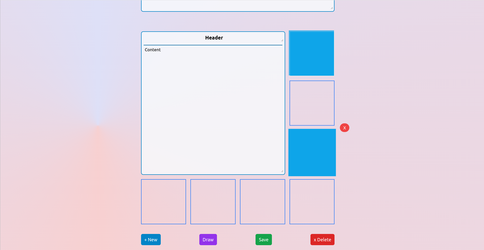

## Tiling Notes

If You are familiar with windows tiling manager, than this would be similar to that but this one is for notes rather than for desktop applications.
I made this with the help of React, Next.js and also TailwindCSS. 

### Features
- Customizable layout
- It's accesible on the web, or offline if you serve it with npm run dev
- Nice design
- Create as many notes as you want

More features coming soon!

